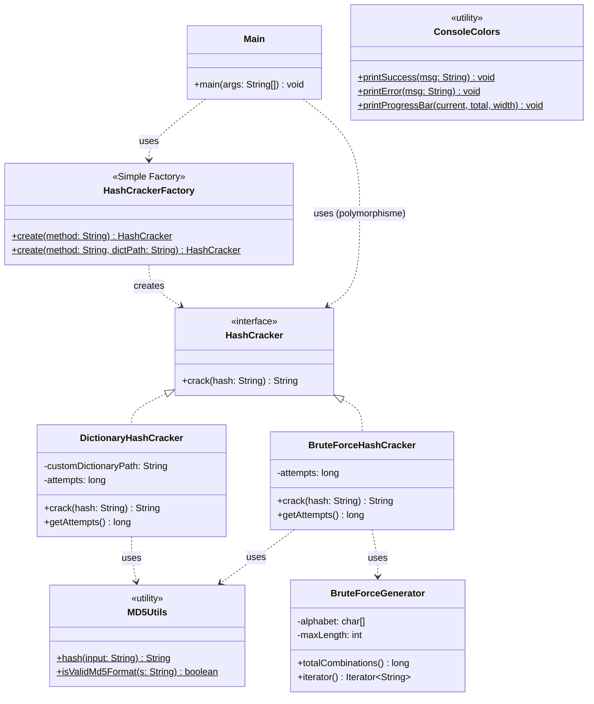

# PasswordCracker v1

**Mini-projet 1 – Mise en œuvre du patron Simple Factory**
Outil en ligne de commande permettant de retrouver un mot de passe en clair à partir de son empreinte MD5, par attaque **dictionnaire** ou **force brute**.


---

## Sommaire

1. [Introduction](#1-introduction)
2. [Présentation du problème](#2-présentation-du-problème)
3. [Architecture](#3-architecture)
4. [Diagramme UML](#4-diagramme-uml)
5. [Usage du patron Simple Factory](#5-usage-du-patron-simple-factory)
6. [Installation et exécution](#6-installation-et-exécution)
7. [Résultats obtenus](#7-résultats-obtenus)
8. [Difficultés rencontrées](#8-difficultés-rencontrées)
9. [Conclusion](#9-conclusion)
10. [Questions de réflexion](#10-questions-de-réflexion)

---

## 1. Introduction

Dans le domaine de la cybersécurité, les mots de passe ne sont (presque) jamais stockés en clair : ils sont transformés par une fonction de hachage cryptographique, MD5 étant un exemple historique bien connu — aujourd'hui obsolète pour un usage réellement sécurisé, mais pédagogiquement idéal car rapide à calculer et facile à manipuler.

**PasswordCracker** est un outil d'audit qui tente de retrouver un mot de passe en clair à partir de son hash MD5, afin d'évaluer la robustesse des mots de passe utilisés dans un système. Cette version 1 se concentre sur la mise en œuvre d'une architecture orientée objet modulaire, construite autour du patron de conception **Simple Factory**.

## 2. Présentation du problème

Étant donné un hash MD5, on souhaite retrouver le mot de passe source en testant des candidats et en comparant leur hash à celui recherché. Deux approches sont demandées :

| Stratégie | Principe | Avantage | Limite |
|---|---|---|---|
| **Dictionnaire (`DICO`)** | Teste une liste de mots connus/probables | Très rapide | Ne trouve que les mots du dictionnaire |
| **Force brute (`BRUTE`)** | Génère toutes les combinaisons possibles (a-z, longueur ≤ 4) | Trouve *tout* mot de passe dans l'espace couvert | Coût exponentiel avec la longueur |

L'enjeu de conception est de permettre d'ajouter facilement de nouvelles stratégies sans dupliquer de code, en s'appuyant sur le **polymorphisme** et une **fabrique centralisée**.

## 3. Architecture

### Responsabilités des classes

| Classe | Responsabilité |
|---|---|
| `HashCracker` | Interface commune définissant le contrat `crack(hash): String` que toute stratégie doit respecter. |
| `DictionaryHashCracker` | Implémente la stratégie par dictionnaire : charge une liste de mots (embarquée ou fichier externe), hache chaque mot et compare au hash cible. |
| `BruteForceHashCracker` | Implémente la stratégie par force brute : délègue la génération des combinaisons à `BruteForceGenerator` et compare chaque candidat. |
| `HashCrackerFactory` | **Simple Factory** : point de création unique, retourne l'implémentation adéquate selon la méthode demandée (`DICO` / `BRUTE`). |
| `Main` | Point d'entrée CLI : parse les arguments, délègue à la fabrique, mesure le temps d'exécution, affiche le résultat. Ne connaît **aucune** classe concrète de stratégie. |
| `utils.MD5Utils` | Utilitaire statique de calcul et de validation de hash MD5 (évite la duplication entre les deux stratégies). |
| `utils.BruteForceGenerator` | Génère les combinaisons de caractères à la volée (itérateur façon "odomètre"), sans les stocker toutes en mémoire. |
| `utils.ConsoleColors` | Utilitaire d'affichage : couleurs ANSI, barre de progression, messages de succès/erreur/info. |

### Principes appliqués

- **Single Responsibility** : chaque classe a un unique rôle (ex : `MD5Utils` ne fait que du hachage, `ConsoleColors` ne fait que de l'affichage).
- **Polymorphisme** : `Main` manipule uniquement le type `HashCracker`, sans connaître la classe concrète réellement instanciée.
- **Centralisation de la création** : seule `HashCrackerFactory` instancie `DictionaryHashCracker` et `BruteForceHashCracker`.
- **Pas de duplication** : la logique de hachage MD5 est mutualisée dans `MD5Utils`, utilisée par les deux stratégies.

## 4. Diagramme UML



## 5. Usage du patron Simple Factory

Le patron **Simple Factory** n'est pas un des 23 patrons du Gang of Four à proprement parler : c'est un idiome de conception très répandu qui centralise la logique de création d'objets dans une méthode statique dédiée.

**Mise en œuvre dans ce projet :**

```java
public class HashCrackerFactory {
    public static HashCracker create(String method) {
        return switch (method.toUpperCase()) {
            case "DICO"  -> new DictionaryHashCracker(null);
            case "BRUTE" -> new BruteForceHashCracker();
            default -> throw new IllegalArgumentException("Méthode inconnue : " + method);
        };
    }
}
```

**Ce que cela apporte concrètement ici :**

- `Main` ne fait **jamais** `new DictionaryHashCracker()` ni `new BruteForceHashCracker()` : il demande à la fabrique de lui fournir un `HashCracker`, sans savoir (ni avoir besoin de savoir) quelle classe concrète est réellement instanciée.
- Si demain on souhaite changer l'implémentation associée à `"DICO"` (par exemple utiliser un dictionnaire trié pour une recherche dichotomique), seul le corps de la fabrique change — `Main` reste identique.
- Le code appelant manipule uniquement l'abstraction `HashCracker`, ce qui illustre le principe **"programmer pour une interface, pas une implémentation"**.

## 6. Installation et exécution

### Prérequis

- **JDK 17** ou supérieur (aucune dépendance externe requise, aucun outil de build tiers nécessaire)
- Vérifier l'installation : `javac -version` doit afficher un numéro de version

### Compilation et exécution (invite de commandes Windows `cmd`)

```cmd
git clone https://github.com/OusmaneBa22/password-cracker.git
cd password-cracker
mkdir out
dir /s /b src\main\java\*.java > sources.txt
javac -d out -encoding UTF-8 @sources.txt
copy src\main\resources\dictionnaire.txt out\
java -cp out com.passwordcracker.Main -m DICO -h 5ebe2294ecd0e0f08eab7690d2a6ee69
```

> **Prérequis :** le JDK doit être installé et son dossier `bin` ajouté au `PATH` (vérifier avec `javac -version`). Voir [Adoptium Temurin](https://adoptium.net/fr/temurin/releases/) pour l'installateur. Pour un affichage correct des couleurs et accents dans la console, exécuter `chcp 65001` avant de lancer le programme.

### Syntaxe complète

```
passwordCracker -m <BRUTE|DICO> -h <hashMD5> [-d <dictionnaire_externe.txt>]
```

| Option | Description | Obligatoire |
|---|---|---|
| `-m` | Méthode de cassage : `BRUTE` ou `DICO` | Oui |
| `-h` | Hash MD5 recherché (32 caractères hexadécimaux) | Oui |
| `-d` | Chemin vers un dictionnaire externe (un mot par ligne), pour la méthode `DICO` | Non — utilise `dictionnaire.txt` embarqué par défaut |

## 7. Résultats obtenus

> *Note : la bannière d'accueil (`PasswordCracker v1.0`) s'affiche systématiquement au lancement du programme ; elle est omise ci-dessous pour la lisibilité des exemples.*

### Exemple 1 — Cassage par dictionnaire (succès)

```
C:\password-cracker>java -cp out com.passwordcracker.Main -m DICO -h 5ebe2294ecd0e0f08eab7690d2a6ee69

╔═══════════════════════════════════════╗
║         PasswordCracker v1.0           ║
║   Simple Factory Pattern - MD5 Cracker ║
╚═══════════════════════════════════════╝

Méthode sélectionnée : DICO
Hash recherché       : 5ebe2294ecd0e0f08eab7690d2a6ee69

Dictionnaire chargé : 50 mot(s) à tester.

──────────────────────────────────────────
✔ Password found: secret
  Tentatives effectuées : 2
  Temps d'exécution     : 48 ms
──────────────────────────────────────────
```

### Exemple 2 — Cassage par force brute (succès, mot de 4 lettres)

```
C:\password-cracker>java -cp out com.passwordcracker.Main -m BRUTE -h 098f6bcd4621d373cade4e832627b4f6

Espace de recherche : 475254 combinaisons possibles (alphabet a-z, longueur 1 à 4).
[======================>       ]  74.78%  (355,414 / 475,254 tentatives)

──────────────────────────────────────────
✔ Password found: test
  Tentatives effectuées : 355,414
  Temps d'exécution     : 716 ms
──────────────────────────────────────────
```

### Exemple 3 — Mot de passe introuvable

```
C:\password-cracker>java -cp out com.passwordcracker.Main -m DICO -h 5b0afe3298130d87ceeee028ee6c104e

Dictionnaire chargé : 50 mot(s) à tester.

──────────────────────────────────────────
✘ Password not found
  Tentatives effectuées : 50
  Temps d'exécution     : 6 ms
──────────────────────────────────────────
```

### Exemple 4 — Validation des arguments

```
C:\password-cracker>java -cp out com.passwordcracker.Main -m FOO -h abc

Erreur d'arguments : Méthode invalide 'FOO'. Valeurs attendues : DICO ou BRUTE.

Usage :
  passwordCracker -m <BRUTE|DICO> -h <hashMD5> [-d <dictionnaire.txt>]
```

*Tous ces scénarios ont été exécutés et vérifiés lors du développement du projet.*

**Campagne de tests complète (11 scénarios, checklist et résultats détaillés) : voir [TESTS.md](TESTS.md).**

**Vidéo de démonstration**  : *[ lien à insérer ici après ]*

## 8. Difficultés rencontrées

- **Espace mémoire de la force brute** : générer à l'avance toutes les combinaisons (jusqu'à 475 254 chaînes pour 4 caractères) aurait été gaspilleur en mémoire pour un espace de recherche plus grand. Solution : `BruteForceGenerator` génère les combinaisons **à la volée** via un itérateur "odomètre", en O(1) mémoire supplémentaire par appel.
- **Encodage de la console** : selon la plateforme, la sortie standard n'utilise pas toujours UTF-8 par défaut, ce qui cassait l'affichage des accents et symboles (✔/✘). Solution : forcer explicitement `System.setOut` avec un `PrintStream` en UTF-8 dans `Main`.
- **Respect strict de l'architecture imposée** : la contrainte "aucune instanciation directe des classes concrètes dans le programme principal" a nécessité de bien réfléchir à la façon d'exposer des statistiques optionnelles (nombre de tentatives) sans polluer le contrat de l'interface `HashCracker` — résolu en gardant `crack()` minimal et en exposant `getAttempts()` comme méthode additionnelle propre à chaque implémentation concrète, consultée via un test de type dans `Main` uniquement à des fins d'affichage.

## 9. Conclusion

Ce mini-projet a permis de mettre en pratique le patron **Simple Factory** dans un contexte concret : une application de cassage de mots de passe où deux stratégies interchangeables (dictionnaire et force brute) sont créées par un point unique, centralisant ainsi la logique de sélection et découplant le code appelant des implémentations concrètes.

L'exercice met aussi en lumière une limite importante de ce patron, approfondie dans les questions de réflexion ci-dessous : la fabrique doit être **modifiée** à chaque ajout de stratégie, ce qui l'éloigne du principe Open/Closed. Cette limite constitue la motivation du prochain mini-projet, qui introduira une architecture plus extensible.

## 10. Questions de réflexion

### 1. Quels avantages apporte la fabrique simple ?

- **Centralisation** : toute la logique de création des objets est regroupée en un seul endroit, ce qui facilite la maintenance et la lecture du code.
- **Découplage** : le code client (`Main`) ne dépend que de l'abstraction `HashCracker` et de la fabrique, jamais des classes concrètes. Il ignore comment et avec quels paramètres chaque stratégie est construite.
- **Simplicité d'utilisation** : un simple appel `HashCrackerFactory.create("DICO")` suffit à obtenir une stratégie prête à l'emploi, sans que l'appelant ait à connaître les détails d'instanciation (constructeurs, dépendances internes, etc.).
- **Point d'extension unique pour la validation** : la fabrique est aussi l'endroit naturel où valider qu'une méthode demandée est bien supportée, avec un message d'erreur clair.

### 2. Quels sont ses inconvénients ?

- **Violation du principe Open/Closed** : ajouter une nouvelle stratégie oblige à modifier le code existant de la fabrique (ajout d'un `case`), plutôt que de simplement l'étendre.
- **Couplage de la fabrique à toutes les implémentations concrètes** : `HashCrackerFactory` doit importer et connaître `DictionaryHashCracker` et `BruteForceHashCracker`, ce qui peut devenir un point de couplage fort si le nombre de stratégies grandit.
- **Un seul point de création statique** : contrairement à une Factory Method (patron GoF) ou une architecture par sous-fabriques, la Simple Factory ne permet pas facilement de spécialiser le comportement de création par sous-classement — elle n'est pas polymorphe elle-même.
- **Risque de "God method"** : si le nombre de stratégies augmente fortement, la méthode `create()` peut devenir longue et difficile à maintenir.

### 3. Que faut-il modifier lorsqu'une nouvelle stratégie est ajoutée ?

Avec l'architecture actuelle, ajouter une stratégie (par exemple `HybridHashCracker` combinant dictionnaire et règles de mutation) nécessite :

1. Créer la nouvelle classe implémentant `HashCracker`.
2. **Modifier `HashCrackerFactory`** pour ajouter un nouveau `case` dans le `switch` du `create()`.

Le point 2 est précisément la limite structurelle de ce patron : le code de la fabrique elle-même doit être touché à chaque extension, ce qui n'est pas idéal pour un système appelé à évoluer souvent.

### 4. La fabrique respecte-t-elle le principe Open/Closed ?

**Non, pas complètement.** Le principe Open/Closed (le "O" de SOLID) stipule qu'une classe devrait être *ouverte à l'extension* mais *fermée à la modification*.

Or ici :
- Les classes de stratégie (`DictionaryHashCracker`, `BruteForceHashCracker`) respectent bien ce principe : on peut ajouter une nouvelle stratégie sans toucher aux stratégies existantes.
- **Mais `HashCrackerFactory` ne le respecte pas** : chaque nouvelle stratégie impose une modification directe du corps de la méthode `create()` (ajout d'un `case` dans le `switch`).

C'est précisément la limite annoncée dans l'énoncé du mini-projet : *"l'ajout d'une nouvelle stratégie nécessite la modification de la classe `HashCrackerFactory`"*. Une évolution possible pour corriger ce point — qui sera étudiée dans le mini-projet suivant — consiste à remplacer la Simple Factory par un mécanisme d'enregistrement dynamique (registre de fabriques, `Factory Method` polymorphe, ou injection via une `Map<String, Supplier<HashCracker>>` alimentée à l'initialisation), permettant d'ajouter une stratégie sans modifier le code de la fabrique elle-même.

---

## Structure du projet

```
password-cracker/
├── README.md
├── TESTS.md
├── dictionnaire.txt                          # Exemple de dictionnaire externe
└── src/main/
    ├── java/com/passwordcracker/
    │   ├── Main.java
    │   ├── HashCracker.java
    │   ├── HashCrackerFactory.java
    │   ├── DictionaryHashCracker.java
    │   ├── BruteForceHashCracker.java
    │   └── utils/
    │       ├── ConsoleColors.java
    │       ├── MD5Utils.java
    │       └── BruteForceGenerator.java
    └── resources/
        └── dictionnaire.txt                  # Dictionnaire embarqué par défaut
```

## Licence

Projet réalisé dans un cadre pédagogique.
